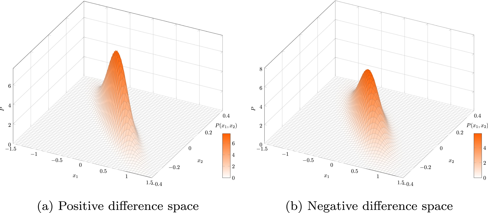
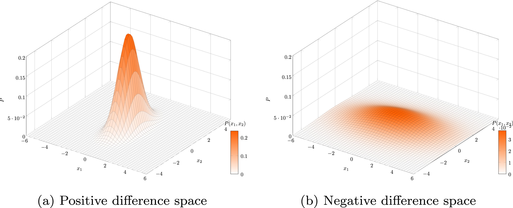

# DMLMJ
Supervised distance metric learning through maximization of the Jeffrey divergence

**How to learn a linear transformation A ?**
```math
\begin{equation}
\underset{\vec{A}\in\mathbb{R}^{D\times m}}{\arg\max} \quad f(\vec{A}) = \text{KL}(P_{\vec{A}}, Q_{\vec{A}}) + \text{KL}(Q_{\vec{A}}, P_{\vec{A}})
\end{equation}
```
 

### Prerequisites
This has been tested using MATLAB 2010A and later on Windows and Linux (Mac should be fine).

## Installation
Download the folder "DMLMJ" into the directory of your choice. Then within MATLAB go to file >> Set path... and add the directory containing "DMLMJ" to the list (if it isn't already). That's it.

## Usage
First we need to learn a linear transformation from supervised data
```matlab
params = struct();
params.kernel = 0;
params.knn = 5;
params.k1 = 5;
params.k2 = 5;
params.dim = 10;
>> L = DMLMJ(XTr, YTr, params)
```
### Parameters
* XTr: Training examples (d x n, where d is the number of features and n is the number of examples)
* YTr: Training labels   (n x 1)
* params (optional): 
   * .kernel (If set to 1, a kerned method is applied, default = 0)
   * .ker    (Kernel type: 'rbf' or 'poly' will be applied, default = 'rbf')
   * .knn    (Number of neighbors, default = 5)
   * .k1     (Positive neighbors)
   * .k2     (Negative neighbors)
   * .dim    (Desired number of dimensionality, default = cross-validation)

Once we have learned L, we can use it for unsupervised data
```matlab
>> X = L'*X;
```
## Authors

* [Bac Nguyen Cong](https://github.com/bacnguyencong)

## Acknowledgments
If you find this code useful in your research, please consider citing:
``` bibtex
@Article{Nguyen2016,
  Title       = {Supervised distance metric learning through maximization of the {J}effrey divergence},
  Author      = {Bac Nguyen and Carlos Morell and De Baets, Bernard},
  Journal     = {Pattern Recognition},
  Year        = {2017},
  Pages       = {215-225},
  Volume      = {64}
}
```

